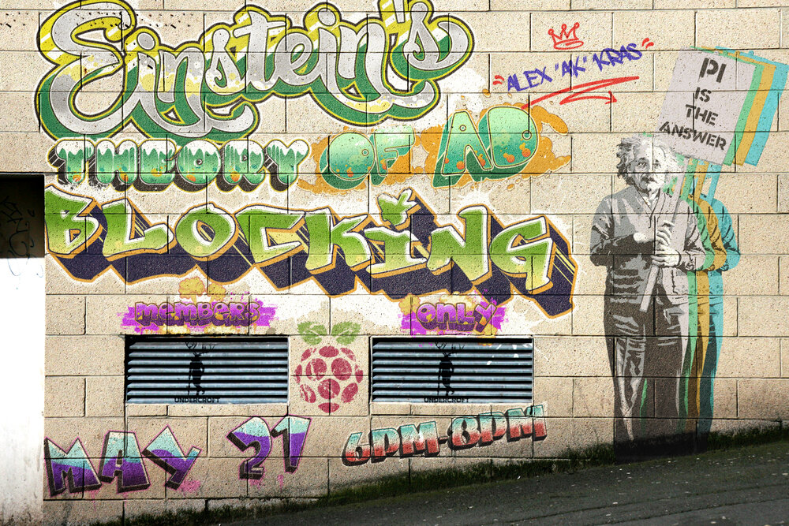

# Einstein's Theory of Ad Blocking

*Not even ads can escape the Event Horizon. Follow along with "AK" (with help from Uncle Nestor(N3S)!) on 5/21 @ 6PM as he demonstrates setup and configuration of a Raspberry Pi, as a one-stop shop for network-wide ad blocking and recursive DNS resolution, utilizing Pi-hole & Unbound. This talk will cover the basics of DNS, along with how the modern internet has helped to shape developments in DNS related protocols such as DNSSEC, DoH and more. Flashing, configuration/setup and best practices for Pi's and GNU/Linux security in general, will be covered. This talk will help to provide a launching point for further experimentation of the very simple yet powerful Pi-hole interface, potentially allowing greater control over your privacy and data. At the very least, you'll get rid of some annoying ads! Recommended hardware (If you don't want to buy the hardware, you can follow along in a VM or Docker): -Raspberry Pi 3b/b+, Pi 4 or even a Pi zero W (Note the lack of ethernet port on the Zero!)*

https://www.theundercroft.net/programming/adblocking

